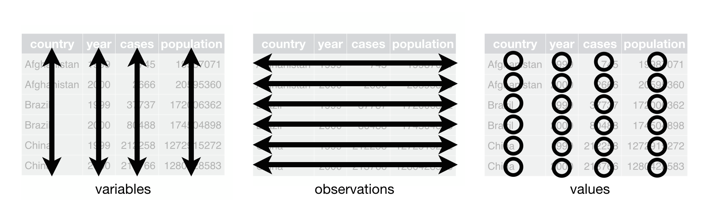

```{r echo=TRUE, message=FALSE, warning=FALSE}
library(tidyverse)
```

# Introdução

Neste tópico estamos aprendendo que é possível representar os mesmos dados de várias maneiras. Veja o caso abaixo: ele mostra os mesmos dados organizados de quatro maneiras diferentes. Cada conjunto de dados mostra os mesmos valores de quatro variáveis, "country" , "year", "population" e "cases", mas cada conjunto de dados organiza os valores de uma maneira diferente.

```{r}
# Exemplo 1
table1
```

```{r}
# Exemplo 2
table2
```

```{r}
# Exemplo 3
table3
```

Todas essas são representações dos mesmos dados subjacentes, mas não são igualmente fáceis de usar. O que estamos apresentando usando o pacote _tidyr_ é que um conjunto de dados tidy é muito mais fácil de trabalhar dentro do _tidyverse_.

Existem três regras inter-relacionadas que tornam um conjunto de dados organizado:

- Cada variável deve ter sua própria coluna.
- Cada observação deve ter sua própria linha.
- Cada valor deve ter sua própria célula.

A Figura 12.1 mostra as regras visualmente.
 

Essas três regras estão inter-relacionadas porque é impossível satisfazer apenas duas das três. Essa inter-relação leva a um conjunto ainda mais simples de instruções práticas:

- Coloque cada conjunto de dados em uma tabela.
- Coloque cada variável em uma coluna.
- Neste exemplo, apenas a tabela 1 está arrumada. É a única representação em que cada coluna é uma variável.

Por que garantir que seus dados estejam organizados? Existem duas vantagens principais:

- Há uma vantagem geral em escolher uma maneira consistente de armazenar dados. Se você tem uma estrutura de dados consistente, é mais fácil aprender as ferramentas que funcionam com ela, porque elas têm uma uniformidade subjacente.

- Há uma vantagem específica em colocar variáveis ​​em colunas porque permite que a natureza vetorizada de R brilhe. Como você aprendeu nas funções mutate e summary, a maioria das funções R integradas funcionam com vetores de valores. Isso faz com que a transformação de dados organizados pareça particularmente natural.

_dplyr_, _ggplot2_ e todos os outros pacotes no tidyverse são projetados para trabalhar com dados organizados. Aqui estão alguns pequenos exemplos que mostram como você pode trabalhar com a table1.

Suponha que você quer computar a taxa de casos por cada 1 milhão de habitantes:

```{r}
table1 %>% 
  mutate(rate = cases / population * 1000000)
```

Ou, por exemplo, que você deseja saber qual o *número de casos por ano*:

```{r}
table1 %>% 
  group_by(year) %>% 
  summarise(cases_year = sum(cases))
```

Uma maneira ainda mais facil de calcular seria usar a função _count()_:

```{r}
table1 %>% 
  count(year, wt = cases) # 'wt' calcula a soma (wt) para cada grupo.
```

E se você quiser ver a mudança desses valores no tempo, bastaria:

```{r}
library(ggplot2)
ggplot(table1, aes(year, cases)) + 
  geom_line(aes(group = country), colour = "grey50") + 
  geom_point(aes(colour = country))
```

Na próxima sessão você mesmo tentará fazer um pouco dessas operações.

# Colocando a "mão na massa"

1. Usando a prosa, descreva como as variáveis e observações são organizadas em cada uma das tabelas de amostra.

2. Calcule a taxa para table2 e table4a + table4b. Você precisará realizar quatro operações:

+ Extraia o número de casos de TB por país por ano.
+ Extraia a população correspondente por país por ano.
+ Divida os casos pela população e multiplique por 10.000.
+ Guarde em local apropriado.
+ Qual representação é mais fácil de trabalhar? Qual é o mais difícil? Por quê?

3. Se você quiser se desafiar um pouco mais, tente recriar o gráfico mostrando a mudança nos casos ao longo do tempo usando a table2 em vez da tabl21. O que você precisa fazer primeiro?

# Pivoting

Os princípios de dados organizados parecem tão óbvios que você pode se perguntar se algum dia encontrará um conjunto de dados que não seja organizado. Infelizmente, porém, a maioria dos dados que você encontrará estarão desordenados. Há duas razões principais:

- A maioria das pessoas não está familiarizada com os princípios de dados organizados e é difícil derivá-los sozinho, a menos que você passe muito tempo trabalhando com dados.

- Os dados costumam ser organizados para facilitar algum uso além da análise. Por exemplo, os dados são frequentemente organizados para tornar a entrada o mais fácil possível.

Isso significa que, para a maioria das análises reais, você precisará fazer algumas arrumações. O primeiro passo é sempre descobrir quais são as variáveis ​​e observações. Às vezes, isso é fácil; outras vezes, você precisará consultar as pessoas que originalmente geraram os dados. A segunda etapa é resolver um dos dois problemas comuns:

1. Uma variável pode ser espalhada por várias colunas.

2. Uma observação pode estar espalhada por várias linhas.

Normalmente, um conjunto de dados sofrerá apenas de um desses problemas; só vai sofrer de ambos se você for realmente azarado! Para corrigir esses problemas, você precisará das duas funções mais importantes no tidyr: _pivot_longer()_ e _pivot_wider()_.

## Longer 

Um problema comum é um conjunto de dados em que alguns dos nomes das colunas não são nomes de variáveis, mas valores de uma variável. Tome a *table4a*: os nomes das colunas 1999 e 2000 representam os valores da variável *year*, os valores nas colunas 1999 e 2000 representam os valores da variável *cases* e cada linha representa duas observações, não uma.

```{r}
table4a
```

Para organizar um conjunto de dados como este, precisamos transformar *(pivot)* as colunas problemáticas em um novo par de variáveis. Para descrever essa operação, precisamos de três parâmetros:

- O conjunto de colunas cujos nomes são valores, não variáveis. Neste exemplo, essas são as colunas _1999_ e _2000_.

- O nome da variável para a qual mover os nomes das colunas. Aqui é *year*.

- O nome da variável para a qual mover os valores da coluna. Aqui estão os *cases*.

Juntos, esses parâmetros geram a chamada para _pivot_longer()_:

```{r}
table4a %>% 
  pivot_longer(c(`1999`, `2000`), 
               names_to = "year", 
               values_to = "cases")
```


As colunas a serem dinamizadas são especificadas com a notação de estilo _dplyr::select()_. Aqui existem apenas duas colunas, portanto, as listamos individualmente. Observe que “1999” e “2000” são nomes não sintáticos (porque eles não começam com uma letra), *então temos que colocá-los entre crases*. Para refrescar sua memória sobre as outras maneiras de selecionar colunas, consulte [selecionar](https://r4ds.had.co.nz/transform.html#select).

_year_ e _cases_ não existem na *table4a*, então colocamos seus nomes entre aspas.


No resultado final, as colunas dinâmicas são eliminadas e obtemos colunas novas colunas _year_ e _cases_. Caso contrário, as relações entre as variáveis originais são preservadas. Visualmente, isso é visual na figura acima.

_pivot_longer()_ torna os conjuntos de dados mais longos, aumentando o número de linhas e diminuindo o número de colunas. Não acredito que faça sentido diferente de um conjunto de dados como sendo no "formato longo". O comprimento é um termo relativo, e você só pode dizer (por exemplo) que o conjunto de dados A é mais longo do que o conjunto B.

Podemos usar _pivot_longer()_ para organizar uma table4b de maneira semelhante. A única diferença é a variável armazenada nos valores da célula:

```{r}
table4b %>% 
  pivot_longer(c(`1999`, `2000`), names_to = "year", values_to = "population")
```

Para combinar as versões organizadas de table4a e table4b em uma única tabela, precisamos usar *_dplyr::left_join()_*, que você também já aprendeu

```{r}
# Passo 1

tidy4a <- table4a %>% 
  pivot_longer(c(`1999`, `2000`), names_to = "year", values_to = "cases")
```


```{r}
# Passo 2
tidy4b <- table4b %>% 
  pivot_longer(c(`1999`, `2000`), names_to = "year", values_to = "population")

left_join(tidy4a, tidy4b)
```


## Wider 

_pivot_wider()_ é o oposto de _pivot_longer()_. Você o usa quando uma observação está espalhada por várias linhas. Por exemplo, tome a table2: uma observação é um país em um ano, mas cada observação é distribuída por duas linhas.

```{r}
table2
```

Para arrumar isso, primeiro analisamos a representação de maneira semelhante a _pivot_longer()_. Desta vez, no entanto, precisamos apenas de dois parâmetros:

- A coluna da qual obter os nomes das variáveis. Aqui, é _type_, tipo.

- A coluna da qual obter valores. Aqui está a _count_, contagem.

Depois de descobrir isso, podemos usar _pivot_wider()_, conforme mostrado de forma programática abaixo, e visualmente na Figura abaixo:

```{r}
table2 %>%
    pivot_wider(names_from = type, values_from = count)

```


 
Como você deve ter adivinhado por seus nomes, _pivot_wider()_ e _pivot_longer()_ são complementos. _pivot_longer()_ torna as tabelas largas mais estreitas e mais longas; _pivot_wider()_ torna as tabelas longas mais curtas e largas.

# Colocando a "mão na massa" 2


1. Crie uma tibble de nome "dataset" com os objetos abaixo:
```{r}
nome = c("Joao Silva","Joao Silva", "Jessica Cordero", "Jessica Cordero")  

dados = c("idade", "altura", "idade", "altura")

valores = c(45, 186, 37, 156)
```

2. O objeto "dataset" deve ser manipulado usando qual função: _pivot_longer()_ ou _pivot_wider()_? Demonstre.

3. Carregue os dados do objeto _table3_. Você precisa analisar esses dados por ano, e deseja que suas variaveis sejam os paises. Para executar isso qual das funções de pivotagem você deve utilizar? Mostre no código. 

4. *Questão diferenciada*. Quem acertar, ou pelo menos tentar, ganha muitos pontos comigo: 

Queremos transformar o objeto _table3_ num formato *wider*, em que queremos que os *anos* sejam as colunas.  No entanto, essa base tem uma coluna chamada _rate_, que significa o número de casos dividido pela população. Note que há um "/" parenteses separando os dois valores, _cases/pop_. Antes de transformar a tabela no formato wider como desejamos, convém separarmos esses dois valores da coluna _rate_. Para fazer isso você deve:

- Passo 1: chamar a *table3* e usar a função *separate()*
```{r}
# table3 %>% 
#  separate())      # Use "help" para entender a função
```

- Passo 2: pegar o novo objeto e aplicar a _pivot_wider()_. Queremos que o *anos* sejam nossas colunas, e que os valores devem vir da coluna *cases*.

- Passo 3: Se você fez os dois primeiros passos corretamente, então o novo banco de dados terá varios _NA_. Vamos assumir que _NA_ = _0_, portanto preencha-os com zero. *Dica:* _Para preencher com zero, use "values_fill"_


