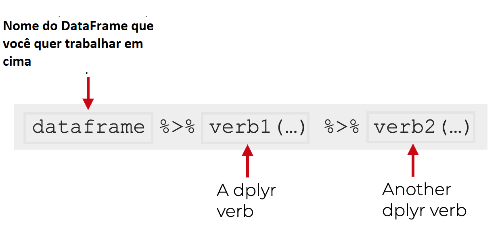
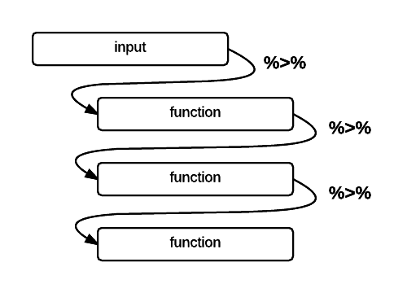
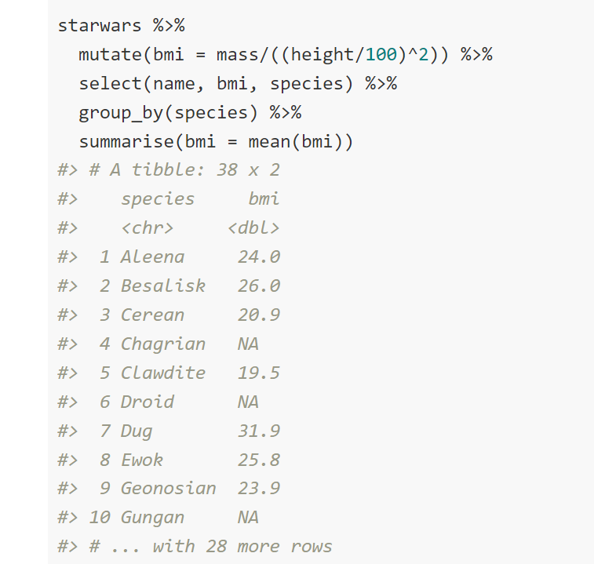

```{r setup, include=FALSE}
knitr::opts_chunk$set(echo = TRUE)
```

# Carregando pacotes necessários
```{r, message=FALSE, warning=FALSE}
library(gapminder) 
library(dplyr)
library(tidyverse)
```

# Instalando e carregando pacote `gapminder`
```{r message=TRUE, warning=FALSE}
install.packages("gapminder")
library(gapminder) 
```


```{r, message=FALSE, warning=FALSE}
gapminder # puxando a base de dados
```

# *Conhecendo os verbos do Dplyr?*

* Linhas: `filter()`, `slice()`, `arrange()`
* colunas: `select()`, `rename()`, `mutate()`, `relocate()`
* grupos de linhas: `summarise()`, `group_by()`

```{r, out.width=850, echo = FALSE, purl = FALSE}
knitr::include_graphics("https://miro.medium.com/max/3680/1*NXRsFH_12sfj79W-P4qI0Q.png")
```


# Aprendendo usar o Operador Pipe - *%>%*

O operador pipe tem a função de permitir o encadeamento de uma função após a outra sem precisar criar variáveis intermediárias ou utilizar parênteses intermináveis. A utilidade principal do pipe é melhorar a leitura do código.

```{r, out.width=850, echo = FALSE, purl = FALSE}

```


Visto de outra forma, seria algo dessa forma.

```{r, out.width=850, echo = FALSE, purl = FALSE}

```

E agora mostrando com um exemplo.

```{r, out.width=850, echo = FALSE, purl = FALSE}

```

# *Vamos entender de ordenação dos dados*

```{r}
tb <- tibble(x = 1:4,    # aqui estamos criando um objeto tibble
y = c(4, 7, 1, 3), 
z = c(10, 10, 22, 22),
k = c(TRUE, FALSE, FALSE, TRUE),
u = c("A", "B", "A", "B"),
vazio = c("NA", 1 , 1, "NA")) 
```

## Pausa para uma dica - **`dput()`**
```{r}
dput(tb) # vamos usar para recriar (de uma forma diferente) o objeto que estamos trabalhando 
```

## Ordenação crescente
```{r}
tb %>% arrange(z, y) # observe que se trata de ordenação crescente
```

## Ordenação descendente
```{r}
tb %>% arrange(desc(z), y)
```

# *Como filtrar os dados - FILTER?*

```{r}
tb %>% filter(x > 2 | u == "A")  # lembre-se q barra vertical "|" significa OU
```

```{r}
tb %>% filter(x > 2 & u == "A")  # lembre-se "&" significa OU
```

# *Como fatiar as linhas - SLICE*?
```{r}
tb %>% slice(1:3) # Somente as 3 primeiras linhas
```

```{r}
tb %>% slice(-(3:5)) # somente as 2 primeiras linhas
```

# **Como selecionar variáveis/colunas?**

## Como selecionar as variáveis por listagem?

```{r}
tb %>% select(x, y) # Inclusão.
```

```{r}
tb %>% select(-z) # Exclusão.
```

```{r}
tb %>% select(y:k) # Intervalo
```

## Como selecionar as variáveis por posição?
```{r}
tb %>% select(3, 2, 1)
```

```{r}
tb %>% select(-(1:2))
```

## Como selecionar as variáveis por condição?
```{r}
tb %>% select_if(is.numeric) # o que É numérico
```

```{r}
tb %>% select_if(negate(is.numeric)) # o que NÃO é numérico
```

# COMO *sortear* AS LINHAS?
```{r}
tb %>% sample_n(size = 3) # por tamanho discreto
```

```{r}
tb %>% sample_frac(size = 0.5) # por tamanho fracionado
```


# *Como realizar transformações - alterar e criar?*

## Para *modificar* uma variável, usamos *MUTATE()*

```{r}
tb %>% mutate(x = x * 2, 
              u = as_factor(u),
              j = median(x))
```

## *Criando* uma variável a partir de outra

```{r}
tb %>% mutate(v = y * z^(x/4))
```

## Renomeando uma variável/coluna
```{r}
# tb %>% rename(nomeNovo = NomeVelho) 
tb %>% rename(nomeNovo = x) 

```

# *Como realizar medidas resumos?*

## Como agrupar por variáveis estratificadoras
```{r warning=FALSE, message=FALSE}
tb %>% count(u) # lembre como era a variável "u"
```

## Usando o "group_by" para agrupar variáveis

```{r, out.width=850, echo = FALSE, purl = FALSE}
knitr::include_graphics("https://blog.dominodatalab.com/wp-content/uploads/2019/03/Freeman_Chp11_Fig08.png")
```


```{r}
tb %>% 
      group_by(u) %>%  # agrupando por u
      summarise(x_mean = mean(x), # summarizando 
          y_range = max(y) - min(y), 
          z_desv = sd(z))
```


```{r}
tb %>%
    group_by(u) %>% 
    summarise_if(is.numeric, mean) # Se var for numérica, calcule média.
```

## Como agrupar usando funções resumo vetoriais
```{r warning=FALSE, message=FALSE}
tb %>% 
    group_by(u) %>% 
    summarise_if(is.numeric, funs(min, median, max))
```


```{r}
# O verbo FILTER permite selecionar uma parte especifica dos dados para realizar sua analise. Deve ser precedido do *%>%* que significa (pegue o que estiver a frente e alimente-o na proxima etapa).

gapminder %>%
  filter (year == 2007)
```

Você poderia mudar o filtro para outra coisa

```{r, message=FALSE, warning=FALSE}
gapminder %>%
  filter(country == "United States")
```

Podemos ter multiplas condições para o filtro, basta separa-las por "," virgula.

```{r, message=FALSE, warning=FALSE}
gapminder %>%
  filter(year == 2007, country == "United States")
```

# ARRANGE verbo

```{r, message=FALSE, warning=FALSE}
# O verbo "arrange" classifica uma tabela baseado em uma variavel (crescente ou decrescente). É muito util quando voce deseja conhecer os valores mais extremos do conjunto do banco de dados.

gapminder %>%
  arrange(gdpPercap)

# Dentro do verbo arrange voce coloca a variavel que orientará a classificacao  
```

Podemos organizar por ordem decrescente via arrange(desc())

```{r, message=FALSE, warning=FALSE}
gapminder %>%
  arrange(desc(gdpPercap))
```

